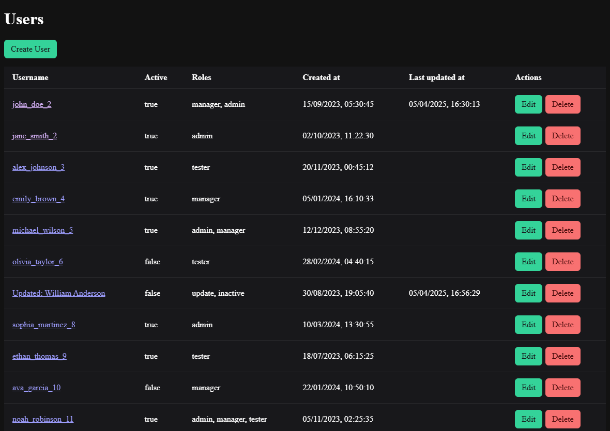
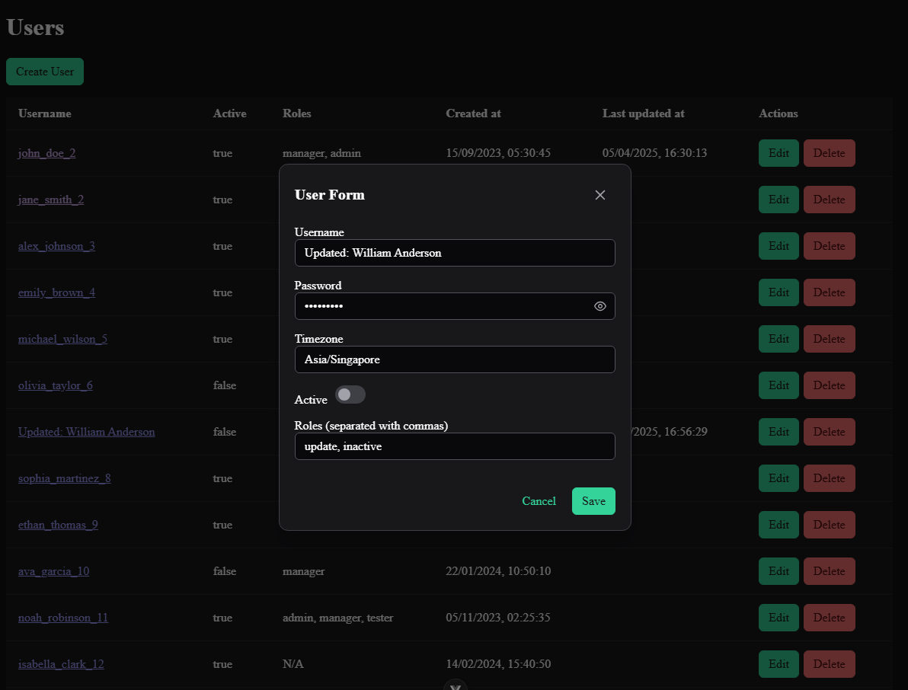
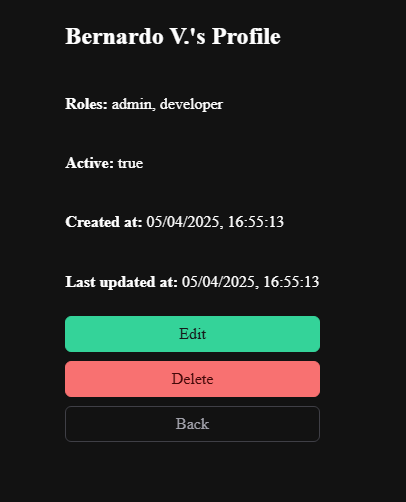

# CRUD | Vue.js + Python

A simple list of users web app with functionalities.

## Preview

<div>
    
    
    
</div>

## Technologies used

- **Front-end:** Vue 3 + PrimeVue (v4).
- **Back-end:** Flask (Python).
- **Database:** MongoDB.
- Import data running **parser.py**.

---

## Requirements

- **Python** Flask server and parser
- **Node.js** Vue
- **MongoDB** running at `localhost:27017` (locally or Docker container)

---

## How to Run

1. **Clone the repository:**
   ```
   git clone https://github.com/your-username/deeper-systems-crud.git
   cd deeper-systems-crud
   ```
2. MongoDB with Docker -
   If you don't have MongoDB installed, you can start a container:

   ```
    docker-compose up -d
   ```

   This will pull the mongo:latest image and run it on localhost:27017.

3. Install and run the back-end in the server folder (Flask)

   ```
   pip install -r requirements.txt
   python parser.py
   python app.py
   ```

4. Install and run the front-end in the client folder (Vue 3)

   ```
   npm install
   npm run dev
   ```

   The Vue dev server will run at http://localhost:5173.

5. Access app

   Front-end: http://localhost:5173

   Back-end API: http://localhost:5000/api/users

### Details:

    File parser.py reads udata.json and inserts data into the users collection.

    If you want to change the database name or other config, update it in parser.py and app.py accordingly.

    And make sure MongoDB is running before running the parser.

    Aditionally, check for CORS policy on your browser.
# deeper-systems-crud
